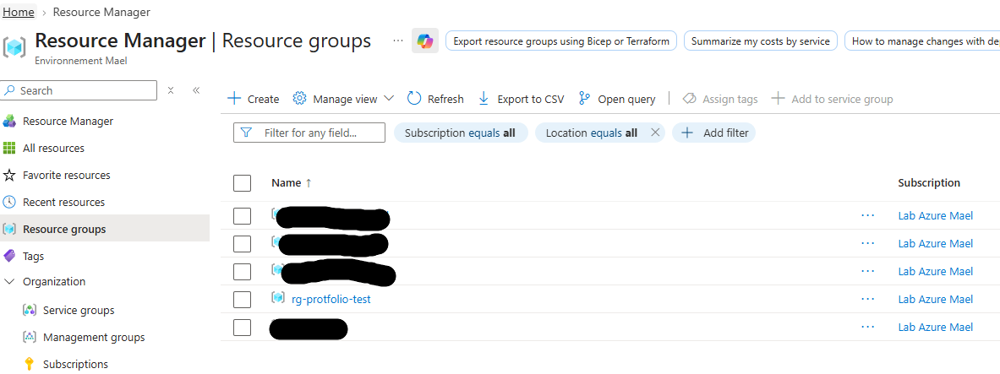
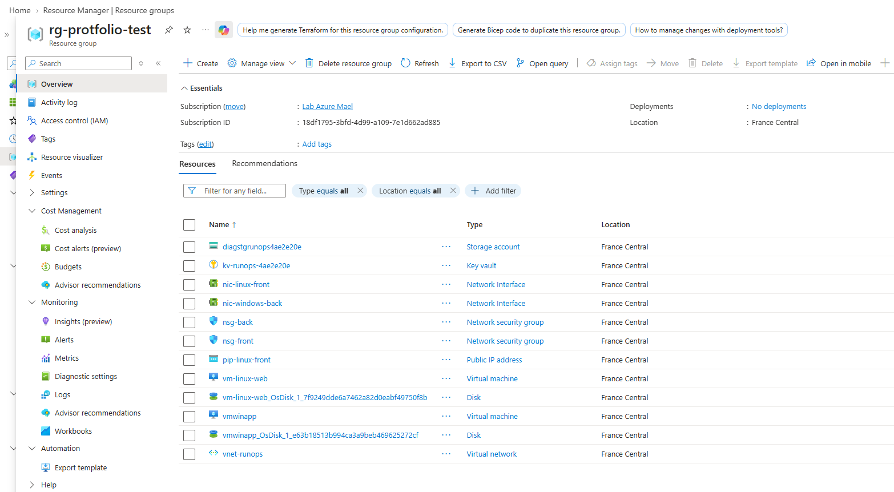
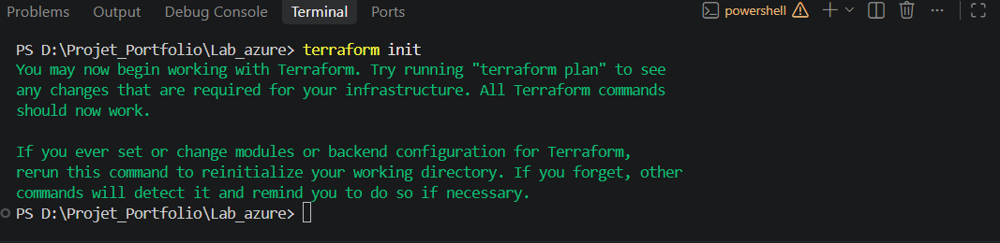
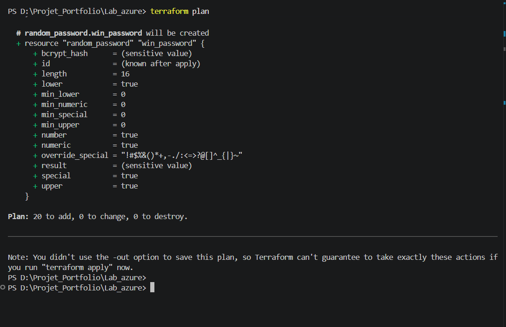
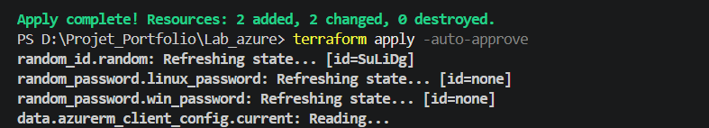

# ☁️ Azure RUNOps : Déploiement, Monitoring et Auto-remédiation d'une Infrastructure Hybride

Ce projet est une simulation complète d'un environnement d'entreprise sur Microsoft Azure. Il a été conçu pour démontrer des compétences avancées en ingénierie Cloud orientées **Opérations (RUN), MCO (Maintien en Conditions Opérationnelles)** et **Automatisation**.

Le projet répond directement aux exigences classiques d'une démarche ITIL : déploiement sécurisé, gestion des correctifs (patching), supervision, et résolution d'incidents (N1/N2) automatisée.

## 📸 Aperçu du Déploiement

!

## 🛠️ Stack Technique
*   **Infrastructure as Code (IaC) :** Terraform
*   **Cloud Provider :** Microsoft Azure
*   **OS :** Windows Server 2022 & Ubuntu Linux 22.04 LTS
*   **Automatisation & Scripting :** PowerShell, Azure Automation
*   **Sécurité & Secrets :** Azure Key Vault, Managed Identities

---

## 🚀 Les 3 piliers du Projet

### 1. Architecture & Sécurité "Zero Trust" (Étape 1)
L'infrastructure a été déployée via Terraform avec une approche sécurisée dès la conception :
*   **Réseau isolé :** Création d'un VNet avec deux sous-réseaux (Front-End et Back-End).
*   **Contrôle d'accès strict (NSG) :** La VM Windows (Backend) n'a aucune IP publique et n'est accessible en RDP que depuis le sous-réseau Front-End (modèle Bastion). Le SSH sur la VM Linux est restreint.
*   **Gestion des secrets :** Aucun mot de passe n'est écrit en clair dans le code. Terraform génère des mots de passe aléatoires forts et les injecte directement dans **Azure Key Vault** lors du provisionnement.
*   **Flexibilité RUN :** Le code a été pensé pour pouvoir s'intégrer à l'existant. J'utilise couramment les blocs `data` pour m'interfacer avec des ressources préexistantes, ou la commande `terraform import` pour reprendre le contrôle d'infrastructures "legacy".

### 2. Monitoring & Patch Management (Étape 2)
Un environnement de production nécessite une supervision proactive et des mises à jour régulières :
*   **Azure Monitor & Log Analytics :** Déploiement d'un espace de travail centralisé pour la collecte de logs et des métriques.
*   **Alerting Critique :** Configuration d'une règle d'alerte se déclenchant si le CPU de la VM Linux dépasse 90% pendant 5 minutes.
*   **Azure Update Manager :** Implémentation d'une stratégie de patching automatisée (Maintenance Configuration). Les mises à jour de sécurité critiques pour Windows et Linux sont planifiées automatiquement tous les dimanches à 2h du matin.

### 3. Auto-remédiation / Self-Healing (Étape 3)
C'est le cœur de la démarche DevOps appliquée à l'exploitation. Au lieu d'une simple alerte passive, le système se répare de lui-même :
*   **Azure Automation Account :** Configuration d'un compte avec une identité managée (SystemAssigned) dotée du rôle de "Contributeur de machine virtuelle".
*   **Runbook PowerShell :** Création du script `auto-remediation-restart-vm.ps1`[cite: 1] qui est capable d'analyser le payload JSON d'une alerte (Webhook) pour identifier la ressource défaillante[cite: 1].
*   **Action automatisée :** Dès que l'alerte CPU se déclenche, l'Action Group appelle le Webhook, ce qui lance le Runbook PowerShell pour redémarrer automatiquement la VM en souffrance, réalisant ainsi une action de support N1 sans intervention humaine[cite: 1].

---

## 🐛 Troubleshooting & Résolution de Problèmes (Retex)

Lors du développement de ce projet, plusieurs défis techniques liés au fonctionnement interne d'Azure ont été rencontrés et résolus de manière méthodique :

### Problème 1 : Configuration du Scope de Patching
*   **Erreur :** Lors du déploiement de la stratégie de patch (`azurerm_maintenance_configuration`), Terraform a renvoyé l'erreur : ``in_guest_user_patch_mode` must be specified when `scope` is `InGuestPatch``.
*   **Diagnostic & Résolution :** Azure exige de définir explicitement le mode de gestion des patchs lorsque la portée est à l'intérieur de l'OS invité. La correction a consisté à ajouter le paramètre `in_guest_user_patch_mode = "User"` pour déléguer la planification à Azure.

### Problème 2 : Conflit d'orchestration des Mises à jour
*   **Erreur :** Lors de l'assignation de la stratégie de mise à jour aux VMs : `"Patch orchestration mode is not set to AutomaticByPlatform"`.
*   **Diagnostic & Résolution :** Par défaut, les VMs Azure gèrent elles-mêmes leurs mises à jour (via Windows Update ou APT). Pour que l'orchestration centralisée Azure Update Manager fonctionne, il a fallu reconfigurer le socle IaC des VMs (fichier `compute.tf`) avec les arguments suivants :
    ```hcl
    patch_assessment_mode = "AutomaticByPlatform"
    patch_mode            = "AutomaticByPlatform"
    bypass_platform_safety_checks_on_user_schedule_enabled = true
    ```
    Cela a permis de forcer la VM à accepter la planification dictée par Terraform.

---

## ⚙️ Comment déployer ce projet ?

1. Cloner ce dépôt.
2. S'authentifier sur Azure via Azure CLI :
   ```bash
   az login
3. Initialiser l'environnement Terraform :
   ```bash
    terraform init


4. Vérifier les ressources qui seront créées :
   ```bash
    terraform plan 



5. Appliquer l'infrastructure :
   ```bash
    terraform apply -auto-approve 
    

